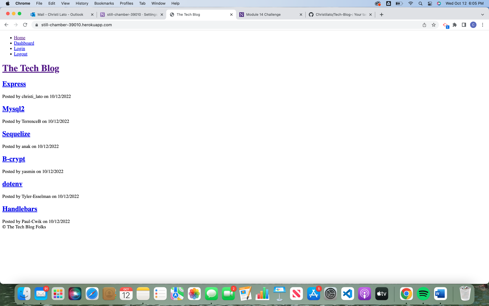

# Tech-Blog-
The purpose of this project was to build a full stack application using the Model-View-Controller paradigm. This application uses a number of different technologies, including: Mysql, Express.js, mysql2 npm package, sequelize npm package, express-handlebars npm package, express-session npm package, connect-session-sequelize npm package, dotenv npm package, and bcrypt npm package.

The Tech Blog Application allows for creation of user accounts, login/logout functionality, viewing and commenting on blog posts, and a user dashboard where authored posts can be edited or deleted.

## Technologies Used
1. Language: Javascript, CSS, Handlebars
2. Database: Mysql
3. NPM: Sequelize, Connection-session-sequelize, express.js, express-handlebars, express-session
dotenv, & bcrypt
4. Environment: Node.js

## Screenshot

## Github link
[Profile-link](https://github.com/Christilato/Tech-Blog-/)

## Heroku Link
[Live-Link] (https://still-chamber-39010.herokuapp.com/)